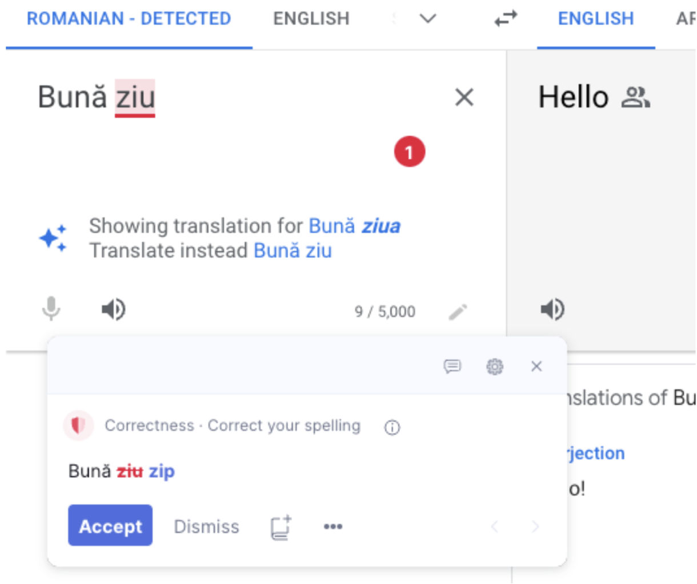

# Grammarly Chrome Extension

## Technology Used

I decided to go with [Puppeteer](https://pptr.dev/) and Jest for automating my test plan. Originally, I had attempted to automate the tests using Cypress, however, I soon realized that it is not possible to test the Grammarly Chrome Extension using Cypress. The reason being that the Cypress Test Runner always runs within an iFrame and the Grammarly Chrome Extension does not support iFrames. This is a known issue that quite a few people have complained about in various forums and had derailed me quite a bit at the start of this assignment.

I have never used Puppeteer before, but luckily the test runner does not run through an iFrame so I was able to use it to test the extension successfully.


## File Structure
```
Puppeteer
|
+-- e2e
|   |
|   +-- commons ⇒ This folder holds the general-purpose selectors used by all test cases
|   |   |
|   |   +-- Utility.js
|   |
|   +-- bootstrap.js ⇒ Configuration and setup needed before running tests on Chromium
|   +-- grammarlyExtTest.spec.js ⇒ Main test class that runs all test cases
|   +-- navigateToSignin.js  ⇒ Used to navigate to signin page
|   +-- activateExt.js ⇒ Used for signing in and checking if the extension is active
|   +-- spellCheck.js ⇒ Used for testing the actual Grammarly spellcheck
|   |
+-- grammarly-chrome–extension ⇒ Holds the extension to be loaded locally
|   |
```

## Test Cases

### Test Case 1: Test if Grammarly Chrome Extension is Installed and Enabled

**Description**

The bootstrap.js file is in charge of loading the Grammarly Chrome Extension locally. I am testing the extension on the website for [Google Translate](https://translate.google.ca/) and I had made the assumption that if the green clickable Grammarly icon displays on the page, then it is considered installed. 

While testing whether the extension is actually enabled and actively running, I realized that first the user must be signed in. The file navigateToSignin.js clicks on the green Grammarly icon and navigates to the signin window via a new tab. 

Once in the signin page, activateExt.js is then used to sign the user agent in through the Gmail login. After the login is successful, the signin tab closes automatically, and we get re-directed to the Google Translate page. We now click on the Grammarly icon again and a pop-up should display telling us that the extension is now active.

**Challenges**

As mentioned above, I am specifically using Gmail to login using a fake Gmail account that was setup for these tests. This was done by design. Originally, I was using the username and password fields to sign in, however, I continued to run into recaptcha issues which cannot be automated unless one uses a paid service such as [2captcha](https://2captcha.com/) along with the following [Puppeteer plugin](https://github.com/berstend/puppeteer-extra/tree/c5828dd01333b6dbb15d74e63d9b866b2b2ff2a6/packages/puppeteer-extra-plugin-recaptcha).

There’s a lot more I would like to add to improve the automation test plan in order to make the code more robust, but I figured it would be beyond the scope of this assignment. For example, I’m relying solely on the UI to test whether the functionality works, however, Grammarly is constantly releasing updates to the UI and my code could easily break with future releases. It might have been better to do assertions using status codes, but not being very familiar with the network requests and limited knowledge of Puppeteer, I decided to rely on the UI for my assertions.


### Test Case 2: Positive Test Case

**Description**

The spellCheck.js file is used to test both the positive and negative test cases. The positive test case loops through a list of words that are known to be incorrect and contains assertions to check whether Grammarly was able to detect these incorrect words within a sentence and then provide us with the expected correction. The examples used are:

The weather is noice ⇒ nice
The weather is beutiful ⇒ beautiful
The weather is werm ⇒ warm

I also took into consideration customizability in my implementation. It is straightforward for anyone looking at my code to add new words to the test as long as they know the expected outcome. I am using a simple hashmap with the following structure:

Map = {incorrect word: correct word, …}


### Test Case 3: Negative Test Case

**Description**

As mentioned before, spellCheck.js file is used to test both the positive and negative test cases. For the negative test case, I took advantage of the fact that Grammarly is not very good at foreign languages. It can correct common foreign words but misses the vast majority of foreign words in any language outside of English. For example, I used Romanian as my language of choice and as you can see in the screenshot below, Google Translate can successfully correct the word, but Grammarly fails to do so.



This negative test case implementation is similar to the positive test case implementation, except I assert that Grammarly cannot correct the foreign word as opposed to checking if it can.
